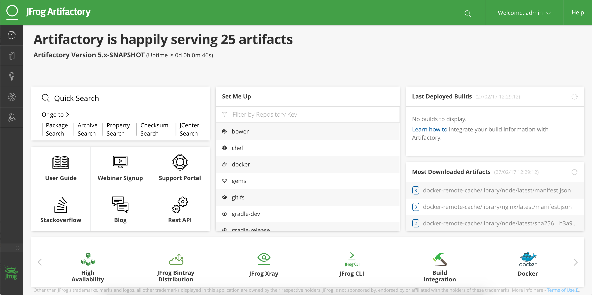

##Artifactory-lb installation guide for DC/OS

## To set up Artifactory-lb in DC/OS following are prerequisites:
1. **Running Artifactory**

## It requires minimum 1 Public Slave to install Artifactory Pro/Enterprise

## Steps to install Artifactory-lb:

1. create `artifactory-lb-options.json` with following contents:
```
{
  "service": {
    "name": "artifactory-lb",
    "cpus": 1,
    "instances": 1,
    "mem": 1024,
    "bridge": false,
    "ssl": {
      "enabled": false,
      "ssl_key_path": "http://www.example.com/example.key",
      "ssl_cert_path": "http://www.example.com/example.crt"
    }
  },
  "artifactory": {
    "name": "artifactory"
  }
}
```
2. Run this command to install Artifactory-lb:
    `dcos package install --options="artifactory-lb-options.json" artifactory-lb`

##### NOTE:  If name of your artifactory service is not "artifactory" then change it under artifactory tab. 
##### Use pre populated API KEY in case you have changed artifactory password.
##### It needs port 5000-5010 open to use artifactory as docker registry.

##Awesome!! now you can access artifactory UI by going to public ip of node where Artifactory-lb is running.

Here is how Artifactory UI looks like!!!
