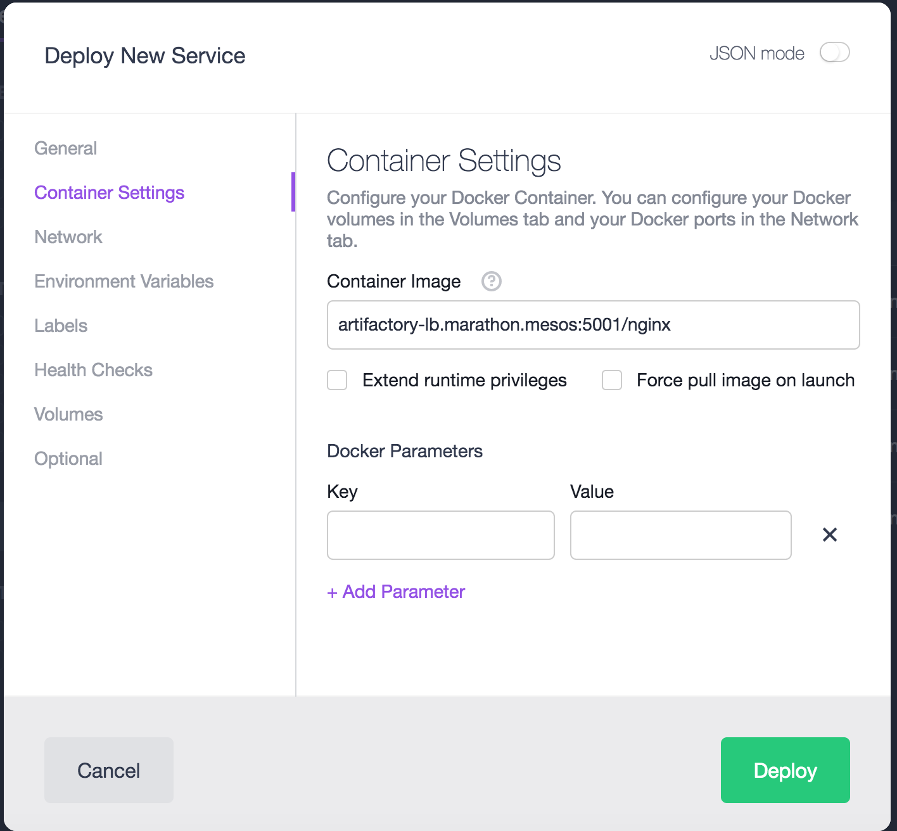
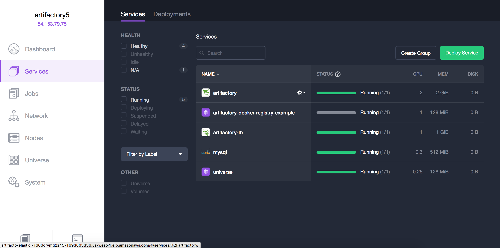
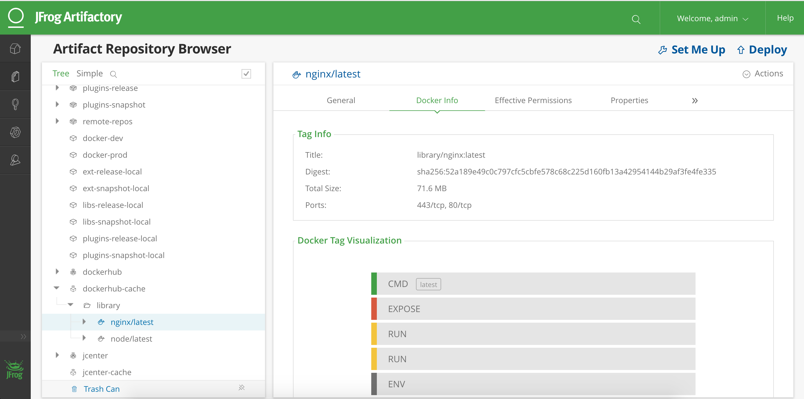

##Artifactory-lb installation guide for DC/OS

## To set up Artifactory-lb in DC/OS following are prerequisites:
1. **Running Artifactory**

## It requires minimum 1 Public Slave to install Artifactory Pro/Enterprise

## Steps to install Artifactory-lb:

1. create `artifactory-lb-options.json` with following contents:
```
{
  "service": {
    "name": "artifactory-lb",
    "cpus": 1,
    "instances": 1,
    "mem": 1024,
    "bridge": false,
    "ssl": {
      "enabled": false,
      "ssl_key_path": "http://www.example.com/example.key",
      "ssl_cert_path": "http://www.example.com/example.crt"
    }
  },
  "artifactory": {
    "name": "artifactory"
  }
}
```
2. Run this command to install Artifactory-lb:
    `dcos package install --options="artifactory-lb-options.json" artifactory-lb`

##### NOTE:  If name of your artifactory service is not "artifactory" then change it under artifactory tab. 
##### Use pre populated API KEY in case you have changed artifactory password.
##### It needs port 5000-5010 open to use artifactory as docker registry.

##Awesome!! now you can access artifactory UI by going to public ip of node where Artifactory-lb is running.

Here is how Artifactory UI looks like!!!


---

## Steps to use artifactory as docker registry

####Insecure
In case you'd like to run an insecure registry without using any TLS certificates, you can configure the nodes in your DC/OS cluster to work without certificates or security.

This basically tells the Docker engine in each node to entirely disregard security for your registry. While this is relatively easy to configure the daemon in this way, it is very insecure. It does expose your registry to trivial MITM. Only use this solution for isolated testing or in a tightly controlled, air-gapped environment.
Run this in all agent nodes of your cluster:

```
sudo cp /usr/lib/systemd/system/docker.service /etc/systemd/system/docker.service

sudo vim /etc/systemd/system/docker.service

add this line: Environment="DOCKER_OPTS=--insecure-registry artifactory-lb.marathon.mesos:5001”

sudo systemctl daemon-reload

sudo systemctl restart docker.service
```

####Pull image from local registry

The Docker registry at `artifactory-lb.marathon.mesos:5001` is now available for use in your Marathon applications. It can be used to launch applications from the GUI or the CLI interfaces.

#### From the Marathon UI

Simply use ```artifactory-lb.marathon.mesos:5001``` as a prefix in the `Container Settings`/`Container Image` field of the `Services` form:



Launch your application normally and check it’s working correctly in the “Services” tab:



Check cached image in Artifactory UI




##### From the CLI

Check that your DC/OS CLI is connected properly to the DC/OS cluster:

```
$ dcos node
  HOSTNAME       IP                         ID                    
 10.0.0.78   10.0.0.78   2bbf0f97-5c2b-453b-9ecc-e1023411d770-S5  
 10.0.2.27   10.0.2.27   2bbf0f97-5c2b-453b-9ecc-e1023411d770-S3  
 10.0.3.224  10.0.3.224  2bbf0f97-5c2b-453b-9ecc-e1023411d770-S0  
 10.0.3.228  10.0.3.228  2bbf0f97-5c2b-453b-9ecc-e1023411d770-S4  
 10.0.5.162  10.0.5.162  2bbf0f97-5c2b-453b-9ecc-e1023411d770-S1  
 10.0.7.12   10.0.7.12   2bbf0f97-5c2b-453b-9ecc-e1023411d770-S2  
```

Write a JSON file that uses the image from the local registry:

```
$cat registry-example-app.json
{
  "id": "/artifactory-registry-docker-example",
  "cmd": null,
  "cpus": 1,
  "mem": 128,
  "disk": 0,
  "instances": 1,
  "executor": null,
  "fetch": null,
  "constraints": null,
  "acceptedResourceRoles": null,
  "user": null,
  "container": {
    "docker": {
      "image": "artifactory-lb.marathon.mesos:5001/nginx",
      "forcePullImage": false,
      "privileged": false,
      "portMappings": [
        {
          "containerPort": 80,
          "protocol": "tcp",
          "name": "http"
        }
      ],
      "network": "BRIDGE"
    }
  },
  "labels": null,
  "healthChecks": null,
  "env": null
}
```

Load that JSON into Marathon:

```
$ dcos marathon app add registry-example-app.json
```

Check that the application is running properly:

```
$ dcos marathon app list
ID                                    MEM   CPUS  TASKS  HEALTH  DEPLOYMENT  CONTAINER  CMD   
/artifactory                          2048   2     1/1    1/1       ---        DOCKER   None  
/artifactory-lb                       1024   1     1/1    1/1       ---        DOCKER   None  
/artifactory-registry-docker-example  128    1     1/1    ---       ---        DOCKER   None  
/mysql                                512   0.3    1/1    1/1       ---        DOCKER   None  
/universe                             128   0.25   1/1    1/1       ---        DOCKER   None  ```
```
