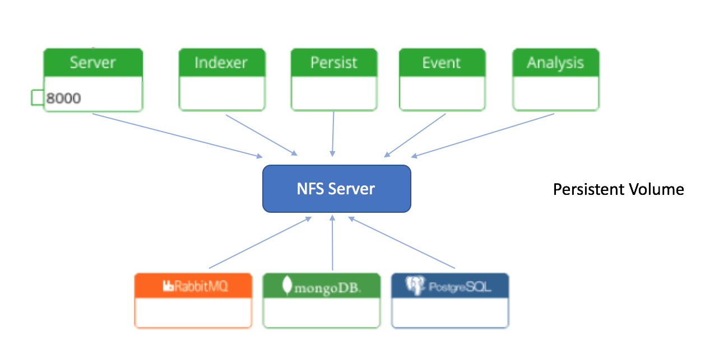
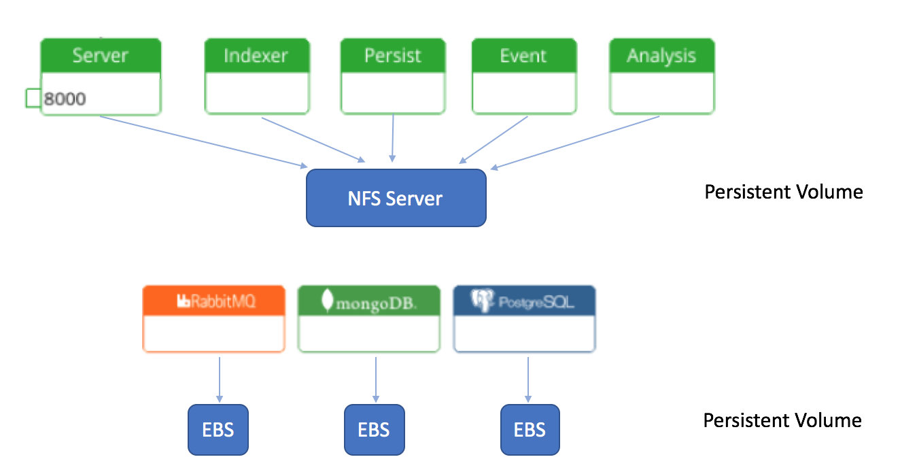
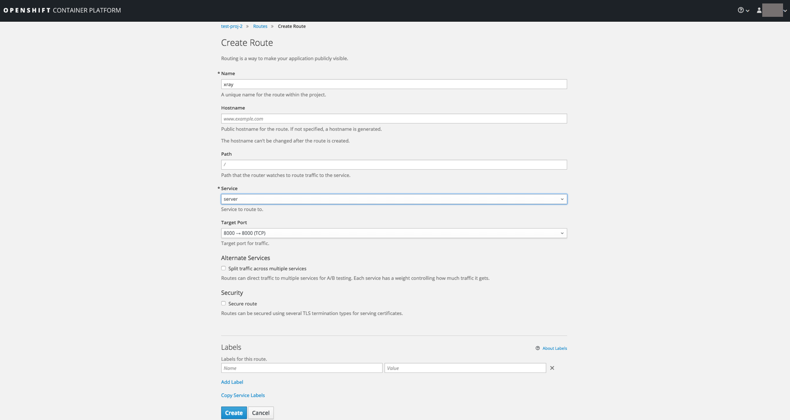
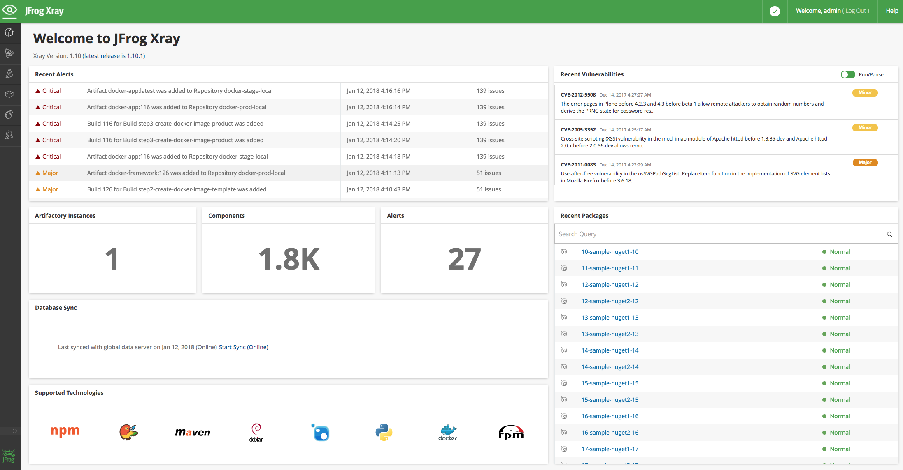

# JFrog Xray templates for OpenShift Container Platform #

The templates part of this github project can be used to install JFrog Xray on OpenShift Container Platform.

These templates have been tested with OpenShift Container Platform 3.6 (single node) and latest version of oc cli (3.7.14).

4 step process to install [JFrog Xray](https://www.jfrog.com/confluence/display/XRAY/Welcome+to+JFrog+Xray) -
* Setup persistent volumes
* Create a project, service account and assign a SCC policy to the service account that will allow RW operations to the PV.
* Deploy templates (ConfigMaps, PersistentVolumeClaims, ImageStreams, DeploymentConfig)
* Create Routes to access JFrog Xray


## Step 1: Setup PersistentVolume ##

There are atleast two ways to setup persistent volume -

### NFS as PersistentVolume for Xray microservices and Third party microservices ###

As part of this architecture, all Xray and third party microservices uses NFS as persistent volume.

The files below can be used as a reference:
* [xray-data-pv.yaml](xray-data-pv.yaml)
* [xray-mongodb-pv.yaml](xray-mongodb/xray-mongodb-pv.yaml)
* [xray-postgres-pv.yaml](xray-postgres/xray-postgres-pv.yaml)
* [xray-rabbitmq-pv.yaml](xray-rabbitmq/xray-rabbitmq-pv.yaml)



*Note: It is recommended to use an NFS server where the ulimit can be set (or is already set) to a higher number. Example - in EFS, the number of open files is only 37k and is not configurable.*

### NFS as PersistentVolume for Xray microservices and EBS for Third party microservices ###

As part of this architecture, all Xray microservices uses NFS and each third party microservice can use EBS or persistent disks.

The files below can be used as a reference:
* [xray-data-pv.yaml](xray-data-pv.yaml)
* [xray-mongodb-ebs-pv.yaml](xray-mongodb/xray-mongodb-ebs-pv.yaml)
* [xray-postgres-ebs-pv.yaml](xray-postgres/xray-postgres-ebs-pv.yaml)
* [xray-rabbitmq-ebs-pv.yaml](xray-rabbitmq/xray-rabbitmq-ebs-pv.yaml)



### Note: ###
It is recommended to setup a high nofile limit by updating `/etc/security/limits.conf` file. At the docker daemon and node level, this number is set to a higher value. But make sure that this value is set to a high number on the file system side.
For more information about ulimits, refer [here](https://www.jfrog.com/confluence/display/XRAY/Installing+Xray#InstallingXray-FileHandleAllocationLimit).


## Step 2: Create a project (or use existing project) and create a service account
```
   oc new-project test-proj-2
   oc create serviceaccount xray-user
```
This service account will be referred in the DeploymentConfig of Xray microservices. Make sure that this service account is assigned a SCC policy that allows RW operations to NFS. The policy can be assigned using -
```
oc adm policy add-scc-to-user $POLICY_NAME -z $SERVICE_ACCOUNT
```


## Step 3: Deploy templates ##

* Update [PARAMETERS_FILE](xray-params.env). This file includes key value pairs required to install Xray.

* The templates are configured with base requirements. It is recommended to increase CPU, memory, disk limits based on your scale.

* Make sure that the project (namespace) exists and the username has the right SCC policy to be able to do RW operations on the PVs.

* Once the templates are updated, run the xray-wrapper script. The xray-wrapper.sh script creates ConfigMaps, PersistentVolumeClaims, ImageStreams and the DeploymentConfig templates of Xray and third party microservices.

``` ./xray-wrapper.sh $USERNAME $PARAMETERS_FILE ```


## Step 4: Create routes ##

* Create a route to access [JFrog Xray](https://www.jfrog.com/confluence/display/XRAY/Welcome+to+JFrog+Xray) UI by selecting 'server' as a 'Service' -


[JFrog Xray](https://www.jfrog.com/confluence/display/XRAY/Welcome+to+JFrog+Xray) UI can be accessed using this route. During the first login, there will be an [onboarding wizard](https://www.jfrog.com/confluence/display/XRAY/Getting+Started).




* Create a route to access RabbitMQ console (to troubleshoot any issue) -


## Upgrade ##

### Usage ###
```

# Login
oc login -u username

# Switch to the correct project or namespace
oc project $NAMESPACE

# Add ImageStreamTag that corresponds to new Xray version.
oc process -f xray-imagestream.yaml -p NAMESPACE=$NAMESPACE -p XRAY_VERSION=$XRAY_TO_VERSION | oc replace -f -

# Update xray-upgrade.sh
Set XRAY_TO_VERSION to point to a newer version

# Execute the upgrade script
./xray-upgrade.sh

```

The upgrade script stops all Xray microservices, update ImageTrigger to point to the new version of Xray and then starts all Xray microservices. 
The new Xray version is set in `xray-upgrade.sh` script. 

*Note that the value of `automatic` in ConfigTrigger will be set to `false` after running the upgrade script.*


## Appendix: ##


### Logs of init containers ###
``` oc logs podName -c init-xray ```


### Configure NFS ###

Update etc/security/limits.conf file and add following two lines
```
0:1040 hard nofile 100000
0:1040 soft nofile 100000
```

### Offline DB Sync ###
* JFrog Xray supports [offline DB sync](https://www.jfrog.com/confluence/display/XRAY/Configuring+Xray#ConfiguringXray-OfflineSynchronization)
* The offline DB sync command downloads files from jxray and bintray. These files can be copied to the PV.
* The best approach will be the usage of a sidecar container pattern that shares the same PVC as Xray microservice and copies the data directly to volume. 

### Installing Xray if a direct access to bintray is not allowed ###
Update DOCKER_REGISTRY value in [PARAMETERS_FILE](xray-params.env) to point to Artifactory's docker registry

### Updating credentials of third party microservices ###
Credentials of MongoDB, RabbitMQ and PostGres can be modified by following these [instructions](https://www.jfrog.com/confluence/display/XRAY/Configuring+Xray#ConfiguringXray-ChangingThirdPartyServiceCredentials)


